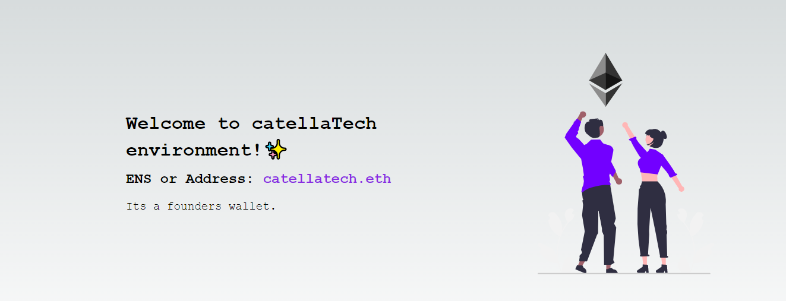

<h1 aling="center">The Ethereum Name Service (ENS)✨</h1>

  <a href="https://github.com/gab0071" target="_blank">
    
  </a>
 

  <br>
  <br>



<h2>What is ENS?</h2>

ENS stands for `The Ethereum Name Service` and it behaves very similar to how DNS behaves in the web2 space. As we all know that Ethereum has long addresses which are hard to remember or type. ENS solves this issue by translating these wallet addresses, hashes etc into readable domains which are then saved on Ethereum blockchain.

The best part about ENS is unlike DNS servers which are centralized, ENS works with the help of a smart contract which is censorship resistant. So now when you are sending your wallet address to someone which looks like `0x1234huiahi....` you can actually send them `tom.eth` and the ENS would figure out that `tom.eth` is actually equal to your wallet address (`0x1234huiahi....`)

Additionally, ENS extends beyond just mapping wallet addresses to human-readable names. You can actually attach a profile picture, a description, social media links, as well as any custom types of data you'd want to attach.

<hr>
<h2> Installing / Getting started </h2>

```bash
# Clone this project
$ git clone https://github.com/gab0071/ENS

# Access
$ cd ENS

# Install dependencies
$ npm install

``` 

<h2>Commands</h2>

- $ ``` npx create-next-app@latest```
- $ ```npm run dev ``` 
<strong>Now go to `http://localhost:3000`, your app should be running </strong>🤘

Open up a terminal pointing at `my-app directory` and execute this command:
- $ ``` npm install web3modal ethers```


<h2> Technologies / Built With </h2>

- Next.js
- Ethers.js
- Web3Modal
<hr>
Hope you enjoy making this.
<br>
<br>

<p align="center">
<br/>
  Made with ❤️ by <b>catellaTech</b>.
</p>